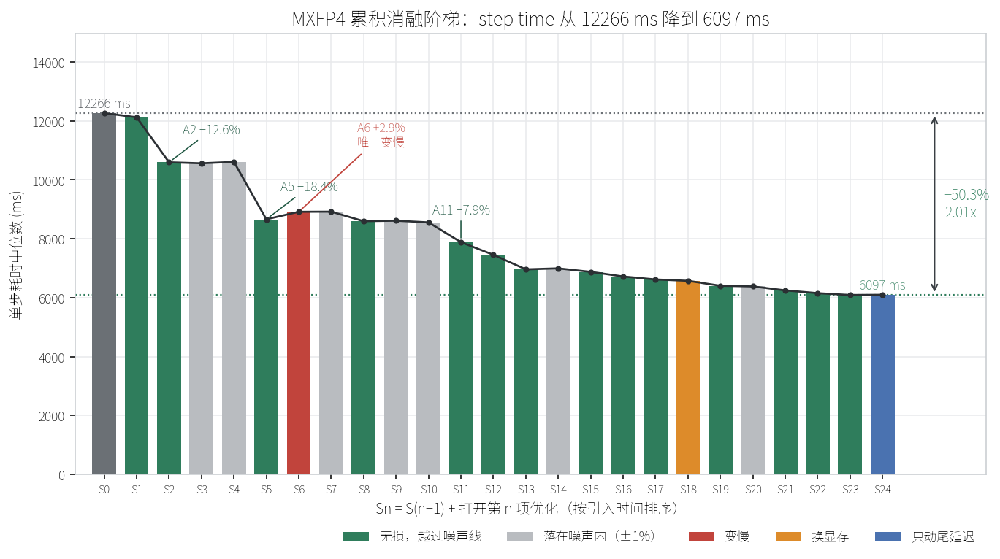
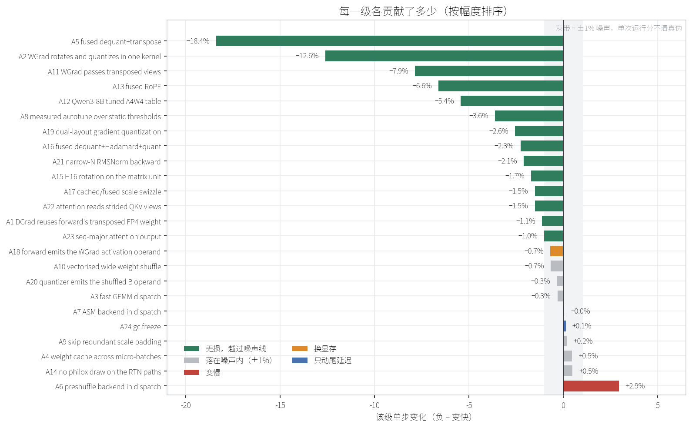
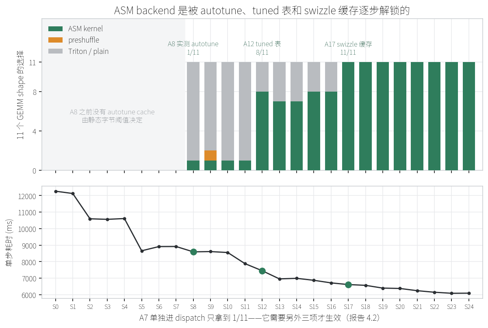
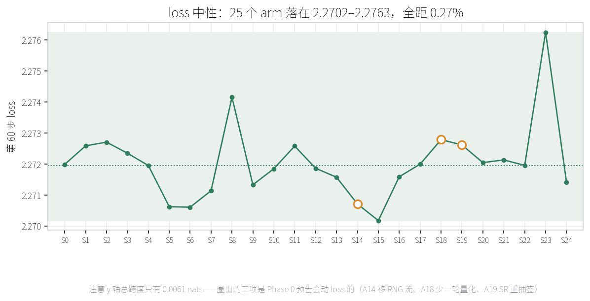
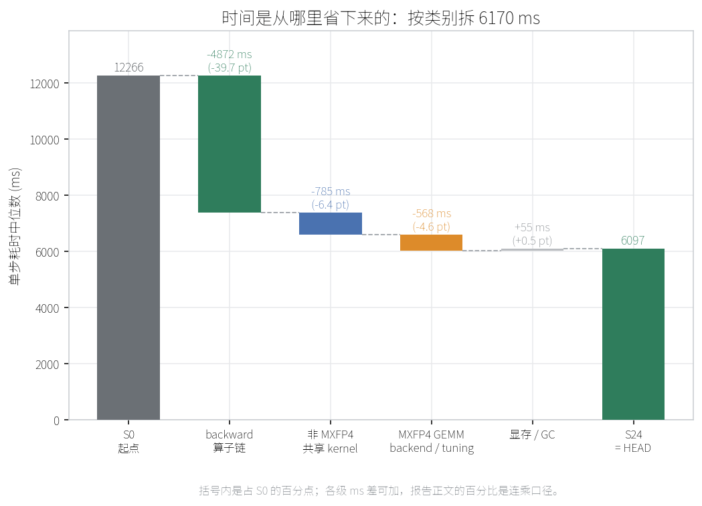
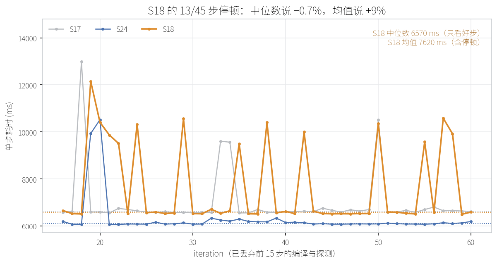

# MXFP4 性能优化消融实验报告（Qwen3-8B · Megatron · 8×MI350X）

**问题：**当前 HEAD 这一整套 MXFP4 优化里，从 7 月底到 8 月中的每一项历史优化各贡献了多少 step time，哪些是无损的，哪些是拿显存换的。

**环境（全程冻结）：**Qwen3-8B · 8×MI350X (gfx950) · Megatron backend · TP1/PP1/CP1/DP8 · seq 8192 · MBS 2 · GBS 128（8 个梯度累积 micro-batch）· tail 5/36 层 BF16（124 个量化 module）· SEED 1234 · `--lumen-linear` 全程开启

**方法：**代码基准始终是 HEAD，不 checkout 历史 commit。18 个 `LUMEN_ABL_*` 开关加 6 个既有 runtime 开关把每项优化单独关掉，构造 stripped baseline `S0`，再按**引入时间顺序**逐项打开，形成 25 级累积阶梯（`S0` + A1–A24）。设计与逐项论证见 `docs/mxfp4_ablation_plan.md`。

**数据：**`examples/qwen3/results/ablation/S{0..24}/run1/`，每个 arm 一份 `train.log` / `summary.json` / `ablation_env.txt`。每 arm 60 步，丢弃前 15 步（Triton 编译 + autotune 探测），对余下 45 步的 per-iteration elapsed time 取中位数。第二节表格的底层数据可用 `python examples/qwen3/ablation/summarize.py` 重新生成（脚本按倍率打印，本报告换成了百分比）。

---

## 一、结论速览

| 指标 | S0（全关） | S24（全开 = HEAD） | 变化 |
| --- | --- | --- | --- |
| step time（中位数） | 12266 ms | **6097 ms** | **−50.3%（2.01x）** |
| 峰值显存占比 | 0.6179 | 0.6388 | +0.021（≈ +5.3 GiB） |
| final loss（第 60 步） | 2.2720 | 2.2714 | 25 个 arm 全距 0.27% |

显存一列是 Megatron 报的占比，MI350X 单卡 251.7 GiB，所以 0.001 ≈ 0.25 GiB。

**三项 backward 算子链优化吃掉了绝大部分收益**，而不是 GEMM：

| 优化 | 单步降幅 | 一句话 |
| --- | --- | --- |
| A5 融合 dequant+transpose | **−18.4%** | 激活的 BF16 (K, M) 中间量不再落显存 |
| A2 WGrad 融合 Hadamard+Quant | **−12.6%** | 旋转结果留在寄存器里直接量化，省两次全局访存往返 |
| A11 WGrad 传 view 不物化转置 | **−7.9%** | 量化核本来就按两个 stride 寻址，两次 `.contiguous()` 白拷 |

GEMM 那一组（A6/A7/A8/A12）合计只有 **−6.1%**，且**必须作为一组读**——单看 A7 是 0、A6 甚至是 +2.9%（见 4.2）。

**优化类型说明：**

- **无损** —— 只改 kernel 选择 / 调度 / 布局，不改数学。已在 Phase 0 用零容差断言逐位验证，loss 曲线重合。
- **换显存** —— 拿显存换速度，本实验只有 A18 一项真的兑现。
- **数值等价** —— 不逐位相同但差异远低于 MXFP4 梯度本身的噪声。

---

## 二、优化历程（step time 逐步下降）



*图 1 · 25 级累积阶梯：绿=无损且越过噪声线，灰=落在 ±1% 噪声内，红=变慢（只有 A6），橙=换显存（A18），蓝=只动尾延迟（A24）。三个大台阶 A2 / A5 / A11 全在 backward 算子链上。*

`Sn` = `S(n-1)` + 打开 `An`。**负数 = 变快**，与 `performance optimization` 那份报告同一口径。"慢步"是 45 步里超过该 arm 中位数 1.3 倍的步数；基线 S0 是 2 步，所以这一列明显高于 3–5 的 arm 才值得追（见 6.1）。慢步与 `--eval-interval 6` 不同步（S0 的两步落在 iter 29 和 56），eval 本身并不越过 1.3 倍线。

| arm | 打开的优化 | step time | 单步降幅 | 累计降幅 | 均值 | 均值/中位 | 慢步 | 显存 | loss |
| --- | --- | --- | --- | --- | --- | --- | --- | --- | --- |
| S0 | stripped baseline，全部关闭 | 12266.1 | — | 起点 | 12785 | 1.042 | 2/45 | 0.6179 | 2.2720 |
| S1 | A1 DGrad 复用 forward 转置好的 FP4 权重 | 12127.0 | −1.1% | −1.1% | 12525 | 1.033 | 2/45 | 0.6179 | 2.2726 |
| S2 | A2 WGrad 融合 Hadamard+Quant | 10597.0 | **−12.6%** | −13.6% | 11033 | 1.041 | 3/45 | 0.6179 | 2.2727 |
| S3 | A3 快速 GEMM dispatch | 10563.4 | −0.3% | −13.9% | 10992 | 1.041 | 3/45 | 0.6179 | 2.2723 |
| S4 | A4 跨 micro-batch 权重缓存 | 10611.4 | +0.5% | −13.5% | 10984 | 1.035 | 4/45 | 0.6179 | 2.2720 |
| S5 | A5 融合 dequant+transpose | 8660.6 | **−18.4%** | −29.4% | 9077 | 1.048 | 5/45 | 0.6179 | 2.2706 |
| S6 | A6 preshuffle backend 进 dispatch | 8915.0 | **+2.9%** | −27.3% | 9267 | 1.039 | 4/45 | 0.6180 | 2.2706 |
| S7 | A7 ASM backend 进 dispatch | 8919.2 | +0.0% | −27.3% | 9370 | 1.051 | 4/45 | 0.6180 | 2.2711 |
| S8 | A8 实测 autotune 取代静态阈值 | 8596.5 | −3.6% | −29.9% | 8937 | 1.040 | 4/45 | 0.6179 | 2.2742 |
| S9 | A9 跳过冗余 scale padding | 8612.8 | +0.2% | −29.8% | 9133 | 1.060 | 5/45 | 0.6179 | 2.2713 |
| S10 | A10 向量化 wide 权重 shuffle | 8555.6 | −0.7% | −30.3% | 8939 | 1.045 | 4/45 | 0.6179 | 2.2718 |
| S11 | A11 WGrad 传转置 view | 7883.3 | **−7.9%** | −35.7% | 8540 | 1.083 | 8/45 | 0.6179 | 2.2726 |
| S12 | A12 Qwen3-8B 专用 tuned A4W4 表 | 7454.0 | −5.4% | −39.2% | 7897 | 1.059 | 4/45 | 0.6180 | 2.2719 |
| S13 | A13 融合 RoPE | 6960.6 | −6.6% | −43.3% | 7262 | 1.043 | 4/45 | 0.6170 | 2.2716 |
| S14 | A14 RTN 路径不抽 philox | 6993.8 | +0.5% | −43.0% | 7423 | 1.061 | 5/45 | 0.6169 | 2.2707 |
| S15 | A15 H16 旋转搬到矩阵单元 | 6874.8 | −1.7% | −44.0% | 7405 | 1.077 | 7/45 | 0.6169 | 2.2702 |
| S16 | A16 融合 dequant+Hadamard+quant | 6718.4 | −2.3% | −45.2% | 7018 | 1.045 | 4/45 | 0.6169 | 2.2716 |
| S17 | A17 缓存/融合 scale swizzle | 6616.9 | −1.5% | −46.1% | 6984 | 1.055 | 4/45 | 0.6169 | 2.2720 |
| S18 | A18 forward 直接产出 WGrad 激活算子 | 6570.5 | −0.7% ⚠ | −46.4% | 7620 | **1.160** | **13/45** | 0.6413 | 2.2728 |
| S19 | A19 dual-layout 梯度量化 | 6402.6 | −2.6% | −47.8% | 6790 | 1.061 | 5/45 | 0.6413 | 2.2726 |
| S20 | A20 quantizer 直接产出 shuffled B | 6380.7 | −0.3% | −48.0% | 6972 | 1.093 | 7/45 | 0.6414 | 2.2720 |
| S21 | A21 narrow-N RMSNorm 反向特化 | 6246.4 | −2.1% | −49.1% | 6947 | 1.112 | 9/45 | 0.6192 | 2.2721 |
| S22 | A22 attention 读 strided QKV view | 6152.2 | −1.5% | −49.8% | 6787 | 1.103 | 8/45 | 0.6413 | 2.2720 |
| S23 | A23 seq-major attention 输出 | 6089.2 | −1.0% | −50.4% | 6469 | 1.062 | 5/45 | 0.6388 | 2.2763 |
| S24 | A24 `gc.freeze` | **6096.6** | +0.1% | **−50.3%** | 6311 | 1.035 | 2/45 | 0.6388 | 2.2714 |

**⚠ S18 这一格不要单独引用**，理由见 6.1。A24 的 +0.1% 也不要当结论，它的效果在均值和慢步那两列（见 4.4）。

把同一批数按幅度重排，能看出收益分布极不均匀：前 3 项占了绝大部分，尾部 10 项挤在噪声带里。



*图 2 · 灰带是 ±1% 噪声。带内的 10 项（含 A6 之外的四个正号）单次运行分不清真伪，见 6.2。*

---

## 三、绝对值为什么和历史报告对不上

本实验**不复现任何历史报告里的数字**，这是设计使然，不是回归：

- 8/10 那批 A/B（1429.0 / 1513.4 ms/step）的协议是 **200 步、GBS 32、c4**（`mxfp4_training_report.md` §5.13）；本实验冻结在 GBS 128，即 4 倍的梯度累积 micro-batch。按 micro-batch 数朴素外推是 1429 × 4 ≈ 5.7 s，与这里 S24 的 6.1 s 同一量级，但这只是量级校验，不是等价换算。
- 那批数字是 **144 个量化 module**；`dfa8618` 之后 tail-BF16 在 `--lumen-linear` 路径上真正生效，本实验全程是 **124 个**。
- 语料是 60 步的 mock corpus（5.13 亿 token）而非 c4，eval 间隔与步数窗口也不同。

跨报告只应比较**相对降幅**，不要比绝对 ms。反过来说，凡是本报告与历史 A/B 在**同一代码路径上**都测过的项（A4 / A17 / A24），两边可以互相印证——见 4.3 与 4.4。

---

## 四、每一步细节

### 4.1 三个大台阶都在 backward 的算子链上

**A5 融合 dequant+transpose（−18.4%，单项最大）。**WGrad 需要激活的转置形式。未融合时要先 `convert_from_mxfp4` 解码出完整的 BF16 (K, M) 张量再转置——这个中间量是两端 FP4 的四倍字节，一写一读全走显存。`827c941` 把解码和转置合成一趟，中间量根本不落地。

**A2 WGrad 融合 Hadamard+Quant（−12.6%）。**`23644ea` 之前是 `hadamard_transform` 写出一个 BF16 旋转结果、`convert_to_mxfp4` 再读回来量化。融合核把旋转留在寄存器里直接量化，省掉两次 kernel launch 和两次全局访存往返。

**A11 WGrad 传 view 不物化转置（−7.9%）。**旧路径用 `.t().contiguous()` 把 `x^T` 和 `grad^T` 都拷成连续张量。量化核本来就按两个 stride 寻址，这两次拷贝纯属白花——`7ef406f` 的 commit message 记的是 ~85 ms/step，比当时所有 MXFP4 GEMM 加起来还多。

这三项都是**无损**：Phase 0 里 A5 / A11 用零容差断言实测逐位相同；A2 是唯一的例外，见 4.5。

### 4.2 A6→A8→A12→A17：ASM 到底是被什么解锁的

单看 A6 和 A7 会得出完全错误的结论。每个 arm 的 autotune cache 记录了 11 个 GEMM shape 各自选中的 backend：



*图 3 · 上：11 个 GEMM shape 各自选中的 backend（S0–S7 没有 cache，由静态阈值决定）。下：同一横轴上的 step time。ASM 覆盖率 1 → 8 → 11 分别由 A8、A12、A17 解锁。*

| arm | 新增 | 11 个 shape 的 backend 分布 | 单步 |
| --- | --- | --- | --- |
| S0–S7 | — | 无 cache（A8 关闭，静态字节阈值决定） | — |
| S6 | preshuffle 进 dispatch | 静态阈值把它选到不划算的 shape 上 | **+2.9%** |
| S7 | ASM 进 dispatch | 仍几乎选不到（阈值 26 MiB，MLP 权重 24 MiB） | +0.0% |
| S8 | 实测 autotune | `asm:1, plain:10` | −3.6% |
| S12 | Qwen3-8B tuned 表 | `asm:8, plain:3` | −5.4% |
| S17 | swizzle 缓存 | `asm:11` | −1.5% |

**A7 在自己的 rung 上是 +0.0%，这不代表 ASM 没用。**plan §4.3 在跑之前就预测了这一点：ASM 要被真正用到需要三件事同时成立——backend 已接入 dispatch（A7，07-29）、该 shape 在 AITER 有 tuned kernel（A12，08-03）、以及策略选中它（静态阈值按另一个模型的 shape 拟合，差 2 MiB 把 Qwen3-8B 的 24 MiB MLP 权重排除在外，只有 A8 的实测 autotune 能纠正）。数据完全印证：11 个 shape 里选中 ASM 的数量是 **1 → 8 → 11**，分别由 A8、A12、A17 解锁。

**A6 单独进 dispatch 反而慢 2.9%**，同样是静态阈值的问题：preshuffle 进了候选表，但没有实测数据来决定该不该用它。这是整条阶梯上唯一一个明显变慢的台阶（其余四个正号都在 ±0.5% 噪声内），也是"新 backend 必须和 autotune 一起上线"的直接证据。

按累积归因，这四项的收益全部记在时间上更早的那一项名下，所以 A7 的 0 和 A6 的 +2.9% 都属于**归因假象**而非真实性能。A6/A7/A8/A12 四项合计 **−6.1%**，加上 A3 dispatch 与 A9/A10 两个 prologue 优化，整条 GEMM 线合计 −6.9%。

### 4.3 A4 权重缓存：独立复现了 8/10 已记录的"在原生 linear 上归零"

plan 按 `mxfp4_training_report.md` §4.4 预估 A4 是"+4.8 GB 换速度"，本实验实测 **+0.5%（略慢，在噪声内），且显存一动不动（0.6179 → 0.6179）**。

这不是新发现，而是**独立复现**：`mxfp4_training_report.md` §5.13 在 8/10 把四个 runtime toggle 在 `--lumen-linear` 新默认路径上重测过一遍，A4 从旧路径的 −25.5 ms 掉到 **−2.2 ms（噪声）**，当时的判断是"原生 module 本来就不做那些缓存要吸收的冗余工作"。本实验全程 pin 在 `--lumen-linear` 上，量到 +0.5%，与那次结论一致（都是"分辨不出"）。累积顺序也指向同一处：A4（07-27）排在 A1（07-26）之后，而 A1 已经把 backward 那次权重重量化去掉了。

**但显存完全不变这件事，两种解释都盖不住**——缓存若真的持有 FP4 权重就必然占显存，无论省不省时间。要么这一项的开关在本配置下没生效，要么权重已被别的机制常驻。**待查，不要据此断言 A4 无用。**

### 4.4 A17 与 A24：两个在历史 A/B 里"归零"的项，在本实验里各有下文

同一份 §5.13 把 A17（cached scale swizzle）和 A24（`gc.freeze`）也判为在原生 linear 路径上不可分辨（−1.5 / −1.1 ms，落在 1.8 ms 的 run-to-run 噪声内）。本实验两项都有更明确的读数：

**A17 实测 −1.5%（−101 ms），不是噪声。**GBS 从 32 到 128 会把绝对收益放大约 4 倍，但 −1.5 ms 折过去也只有 −6 ms，离 −101 ms 差一个量级，所以这不是量纲差异。原因在 backend 上：S17 正是 11 个 GEMM shape 全部选中 ASM 的那一级（S12 起是 8/11）。swizzle 缓存把 scale 准备的开销从 ASM 路径的 prologue 里拿掉，剩下 3 个 shape 才划算到会被 autotune 选走。8/10 那次 A/B 是在 A18–A24 全部生效的 HEAD 上做 leave-one-out，那时 ASM 覆盖率已由别处保证，所以量不到——正是 6.3 说的顺序效应。

**A24 的中位数（+0.1%）是错的口径，均值才是。**§5.13 已经指出 `gc.freeze` 的作用在尾延迟而不是中位数。本实验的数据正好是这个形态：S23 → S24 中位数几乎不动，但**均值 6469 → 6311 ms（−2.4%）**，慢步 **5/45 → 2/45**（与 S0 并列全阶梯最低）。这是消除 GC 停顿的签名，不是稳态变快。因此 A24 不该算进 6.2 的噪声名单，它只是不该用中位数计价。

### 4.5 loss 中性证明

25 个 arm 的第 60 步 loss 落在 **2.2702 – 2.2763，全距 0.27%**，没有任何一级出现方向性漂移。这比事后论证强：如果某项优化改了数学，它的 rung 上 loss 会明显偏离。



*图 4 · 纵轴总跨度只有 0.0061 nats——这张图是放到极限看抖动，不是看趋势。圈出的三项是 Phase 0 事先标记会动 loss 的，它们并没有比别人偏得更远。*

Phase 0 事先标记了三项会动 loss，实测扰动都落在上述带内：

| 项 | 判定 | 依据 |
| --- | --- | --- |
| A1 / A5 / A11 / A16 | **位等价** | 端到端 dX/dW 零容差相同 |
| A9 / A10 / A15 / A17 | **位等价** | 算子级零容差相同；A15 另有一条 poison-`hmat` 测试证明开关真的切了实现 |
| A2 | **非位等价，数值等价** | 未融合的旋转按输入 dtype 返回，中间落一个 BF16 量；dW 对融合结果 SNR > 30 dB，对精确参考 12.98 vs 12.97 dB |
| A14 | 单次 RTN **位等价**，但移动 RNG 流 | 核根本不读 counter；RTN 路径照抽会改变后续 SR 抽签，等价于换随机种子 |
| A19 | scale 位等价，SR 重抽签 | 约 54% 已舍入尾数不同，三个种子下 SNR 相差均在 ±0.05 dB 内，没有哪一种舍得更好 |
| A18 | 非位等价，**dW 数值更优** | 少一轮量化，dW 对精确参考 +1.22 dB（14.22 vs 13.00） |

A18 是唯一改善数值的一项，是这项优化的附带收益而不是问题。

### 4.6 换显存项的定价

全程只有 **A18** 真的用显存换了速度：`0.6169 → 0.6413`，即 **+0.024 占比 ≈ +6.1 GiB**，与 plan 预估的 +6.4 GiB 吻合。A4 预估的 +4.8 GB 没有出现（见 4.3）。

A18 的定价因此不能只看那 −0.7%，见 6.1。

**显存这一列只有台阶可信，逐格不可信。**它是测量窗口内的峰值占比，S21 报了 0.6192、夹在 S20 的 0.6414 和 S22 的 0.6413 之间，中间少掉的 5.6 GiB 没有对应的代码解释——更像是峰值那一步是否落进 45 步窗口的随机性（配 `expandable_segments` 尤其如此）。可以引用的是 S17→S18 那个 +0.024 的整体台阶（此后所有 arm 都在 0.63–0.64 一档），不要引用相邻两格之差。

---

## 五、瓶颈构成的变化

按阶梯的分组降幅，可以直接读出时间从哪里消失的：



*图 5 · 各级 ms 差可加，四组加起来正好是 S0 到 S24 的 6170 ms。backward 算子链一组就占了 4872 ms。*

| 类别 | 涉及的 arm | 合计降幅 |
| --- | --- | --- |
| backward 算子链（量化 / 旋转 / 转置 / 布局融合） | A1, A2, A5, A11, A14–A20 | **−40.4%** |
| 非 MXFP4 共享 kernel（RoPE / RMSNorm / attention 布局） | A13, A21, A22, A23 | −10.9% |
| MXFP4 GEMM backend / tuning / prologue | A3, A6–A10, A12 | −6.9% |
| 显存 / GC | A4, A24 | +0.6%（反向，均在噪声内） |

（四组覆盖全部 24 项且互不重叠，连乘回到 −50.3%。最后一组按中位数计价为 0，但 A24 的价值在尾延迟，见 4.4。）

也就是说：**MXFP4 这一路的性能问题从来不在 FP4 GEMM 本身，而在喂给 GEMM 的那些量化、旋转和转置的数据搬运上。**这也解释了为什么把工程量投在算子融合上的回报远高于继续 tune GEMM。

---

## 六、保留意见（引用数字前必须读）

### 6.1 S18 的数字未定论：中位数说 −0.7%，均值说 +9%

S18 有 **13/45 步**跑到中位数的 1.3 倍以上，均值/中位数是 **1.160**，而相邻 arm 都在 1.05 左右。它的好步稳定在 6510–6660 ms，但散布着 13 个 9500–12100 ms 的步（iter 19–22、24、29、35、38、42、50、55、57、58——不是固定周期；13 个里只有 iter 24 和 42 落在 eval 的 6 的倍数上，所以也不是 eval）。



*图 6 · 三条曲线的虚线是各自的中位数。S17 和 S24 只有零星几个尖峰（4/45 与 2/45），S18 的尖峰贯穿全程。中位数落在下面那条平线上，把上面这些全部忽略掉了。*

- 按**中位数**（本报告的口径）：6570.5 ms，比 S17 快 0.7%。
- 按**均值**：7620 ms，比 S17 的 6984 ms **慢 9%**。

中位数只描述了它的好步，把这些停顿藏了起来。A18 正是加显存那一项（+6 GB），停顿的散布形态更像 allocator 压力而非固定开销（本实验开着 `PYTORCH_HIP_ALLOC_CONF=expandable_segments:True`）。**这一级必须重跑才能定论**，在那之前不要把 −0.7% 当作 A18 的性能结论；它的数值收益（+1.22 dB）是独立成立的。

### 6.2 单次运行，1% 以下的台阶分不清真伪

每个 arm 只跑了 1 次。plan 要求每 arm 2 次、两次中位数相差 >1.5% 则跑第 3 次，这一条**尚未执行**。1%–2% 之间的几级（A15 −1.7%、A17 −1.5%、A22 −1.5%、A21 −2.1%、A23 −1.0%）只能算方向可信、幅度待定——包括 A17，4.4 论证的是它比历史读数高一个量级、不可能全是噪声，不是那 −1.5% 精确。

下列 6 项的单步降幅落在噪声量级，**不应作为定量结论引用**：

| 项 | 实测单步 | 备注 |
| --- | --- | --- |
| A3 快速 dispatch | −0.3% | |
| A4 权重缓存 | +0.5% | 与 8/10 在同一代码路径上的 −2.2 ms（噪声）一致（4.3） |
| A9 scale padding 跳过 | +0.2% | A6/A7 两个 backend 的 prologue |
| A10 向量化 wide shuffle | −0.7% | 同上 |
| A14 philox 跳过 | +0.5% | |
| A20 quantizer 产出 shuffle | −0.3% | B 算子 shuffle，可能被后续 backend 切换吸收 |

A9 / A10 / A20 优化的都是某个 backend 的 prologue，收益取决于该 backend 被选中的比例，需要 leave-one-out 才能单独定价。

**A24 `gc.freeze` 不在此列**：它的中位数是 +0.1%，但均值 −2.4%、慢步 5/45 → 2/45，是尾延迟项而非速度项（4.4）。

### 6.3 累积归因不是 Shapley 贡献

本阶梯按引入时间累积，重叠收益全部记在时间上更早的那一项名下。已知重叠的几对：A1/A4（4.3）、A5/A16、A17/A20、A6/A7/A8/A12（4.2）。要给单项定价必须补 leave-one-out。

### 6.4 A2 / A5 / A16 在 HEAD 默认下不可达

这三项都落在激活的 WGrad 算子链上，A18 打开后 forward 直接把该算子交出来，整条链被短路；A2 还落在梯度算子上，A19 打开后由 dual-layout kernel 接管。所以**在 HEAD 上单独 leave-one-out 这三项会得到 0**——不是因为它们没用，而是那段代码没被执行。累积阶梯里它们的 rung（S2/S5/S16）都早于 A18(S18)/A19(S19)，测的是真的。A15 有同类注意事项。

---

## 七、试过但没采用 / 排除在阶梯外

| 项 | 处理 | 理由 |
| --- | --- | --- |
| `LUMEN_MXFP4_ASM` / `_PRESHUFFLE` 当消融开关 | **不用** | 这两个 env 只在静态兜底路径被读，autotune 打开时仍会实测并选中这两个 backend → 会得到"关掉 ASM 也没变慢"的假结论。A6/A7 的 gate 切在 `_mxfp4_choose_backend` 的候选表层 |
| `b7459ef` Lumen 原生 parallel linear（原 A25） | **不设 arm，全程开启** | 关掉它会同时改变 tail-BF16 policy 的落点（`dfa8618` 只在该路径生效），比较的就是两个 recipe 而不是两个速度 |
| `38414e0` saved_tensors 重构 | 不入阶梯 | 纯 refactor，单文件 9 增 5 删，`tests/ops` 失败集合前后不变 |
| `3975266` / `e7776ff` FP4 all-gather | 不入阶梯 | 仅 FSDP2 路径，本实验是 Megatron track，代码不参与 |
| `745de8f` H16 policy、tail-BF16 policy、`40e2691` WGrad SR→RTN | 不入阶梯 | 属 recipe，改的是数学不是速度，pin 在当前状态 |
| A15 在 dequant+Hadamard+quant 核上造 butterfly 分支 | 不做 | 该核诞生时就只有 MFMA 路径，造一个等于伪造历史 |

---

## 八、怎么复现

```bash
cd ~/Lumen
# 看每个 arm 会导出什么，不跑
bash examples/qwen3/ablation/run_ladder.sh --dry-run --all
# 单个 arm / 关键点子集 / 全阶梯
REPEATS=1 bash examples/qwen3/ablation/run_ladder.sh S0
REPEATS=1 bash examples/qwen3/ablation/run_ladder.sh S0 S5 S8 S12 S18 S24
REPEATS=1 bash examples/qwen3/ablation/run_ladder.sh --all
# 重出本报告第二节的表
python examples/qwen3/ablation/summarize.py
# 重画本报告的六张图到 docs/charts/
python examples/qwen3/ablation/plot_ladder.py
```

画图需要一个同时覆盖中文和拉丁字符的字体。机器预装的 `Droid Sans Fallback` 只有中文，拿它画会把所有数字变成空框，所以 `plot_ladder.py` 在找不到合用字体时直接报错并给出安装命令，而不是默默产出一堆方块。

arm 定义只有一份：`examples/qwen3/ablation/arms.sh`（24 项，按 commit 时间戳排序），由 `tests/ops/test_ablation_ladder_arms.py` 校验与开关注册表一致、每级只动一个变量、最高 arm 等于 HEAD 默认。

两处不能手工代劳的地方，runner 已兜底：**每个 arm 独立的 autotune cache**（共用会让早期 arm 把每个 shape 钉死成 "用 Triton"，后续全部继承，整条阶梯变平且没有任何提示），以及**每个 arm 显式设置全部 24 个开关**（靠默认值会让 arm 依赖上一次跑剩下的环境）。

---

## 九、下一步

1. **重跑 S18**，用中位数和均值同时判定，决定 A18 到底是 −0.7% 还是 +9%（6.1）。
2. **补第二遍全阶梯**，给 6.2 里那 6 项定量或明确判为噪声。25 个 arm 真正在跑 step 的时间合计只有 **224 分钟**，全程约 11 小时，差额几乎全是每个 arm 重复支付的启动（每 arm 约 17 分钟，8 个 rank 各自重建 5.13 亿 token 语料的索引）。把索引缓存掉能把第二遍压到 4 小时左右，建议先做这个再跑。
3. **查 A4 的开关是否真的生效**（4.3）——省时间可以用与 A1 的重叠解释，显存完全不变不能。
4. 对 4.2 / 6.3 里已知重叠的几对补 leave-one-out，作为报告脚注；6.4 那三项只能在阶梯里测，不能用 leave-one-out。
